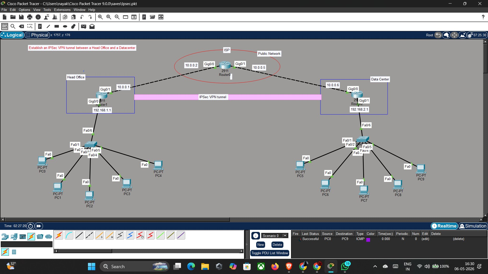
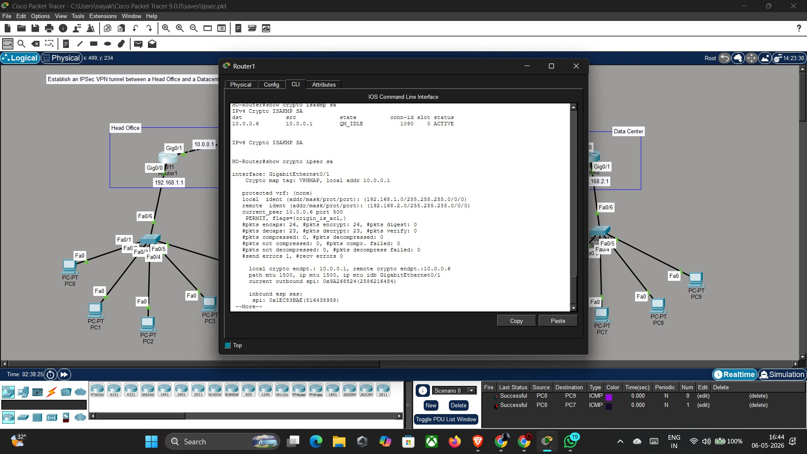
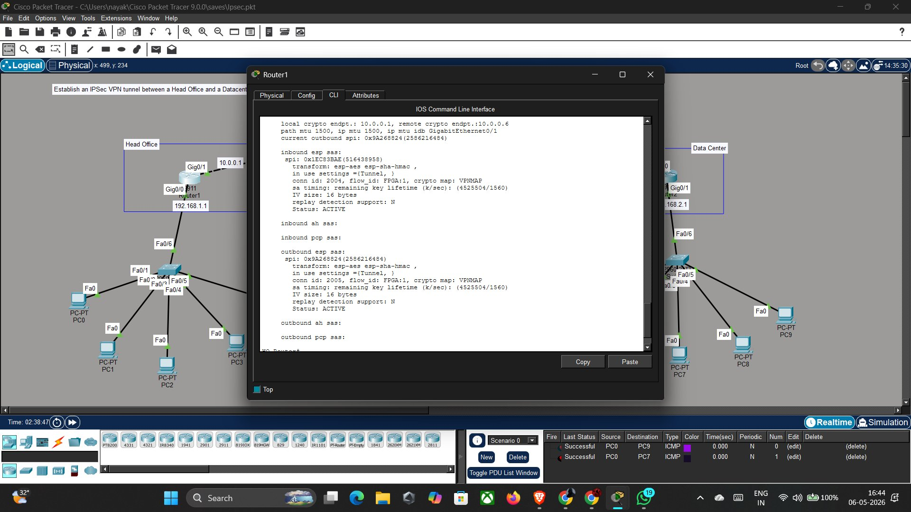
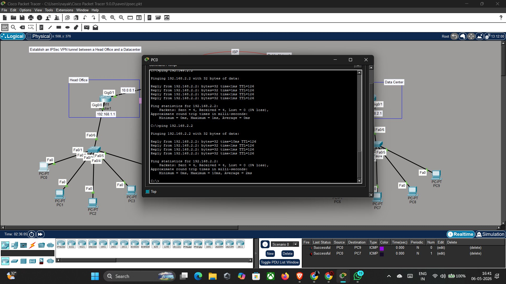

# 🔐 IPSec VPN Tunnel — Head Office to Datacenter

> **Cybersecurity Internship Project | Rooman Technologies**  
> Simulated using **Cisco Packet Tracer 9.0**

---

## 📋 Project Overview

This project establishes a **Site-to-Site IPSec VPN tunnel** between a Head Office (HO) and a Datacenter (DC) over a simulated public internet (ISP). It demonstrates data confidentiality, integrity, and authentication using industry-standard IPSec protocols.

| Field        | Details                        |
|--------------|-------------------------------|
| **Student**  | Nithin Nayaka V N              |
| **Domain**   | Cybersecurity                  |
| **Tool**     | Cisco Packet Tracer 9.0        |
| **Institute**| Rooman Technologies            |
| **Date**     | May 2026                       |

---

## 🗺️ Network Topology

```
[Head Office LAN]          [Public Internet]         [Datacenter LAN]
192.168.1.0/24             10.0.0.0 network          192.168.2.0/24

  PC0–PC4                                              PC5–PC9
     |                                                    |
  Switch0                                             Switch1
     |                                                    |
HO-Router ──── 10.0.0.1/30 ──── ISP-Router ──── 10.0.0.6/30 ──── DC-Router
(Router1)      10.0.0.2/30      (Router0)      10.0.0.5/30        (Router2)
192.168.1.1                                                       192.168.2.1

                    ══════════ IPSec VPN Tunnel ══════════
```

### Device Inventory (15 Total)

| Device | Hostname | Count |
|--------|----------|-------|
| Cisco 2911 Router | HO-Router, ISP-Router, DC-Router | 3 |
| Cisco 2960 Switch | Switch0 (HO), Switch1 (DC) | 2 |
| PC | PC0–PC4 (Head Office) | 5 |
| PC | PC5–PC9 (Datacenter) | 5 |

---

## ⚙️ IPSec Configuration Summary

### IKE Phase 1 (ISAKMP)

| Parameter | Value |
|-----------|-------|
| Policy Number | 10 |
| Encryption | AES-128 |
| Hash | SHA-1 |
| Authentication | Pre-Shared Key |
| DH Group | Group 2 (1024-bit) |
| Lifetime | 86400 seconds |
| Pre-Shared Key | `ROOMAN@VPN` |

### IKE Phase 2 (IPSec)

| Parameter | Value |
|-----------|-------|
| Transform Set | TSET |
| Encryption | ESP-AES |
| Integrity | ESP-SHA-HMAC |
| Mode | Tunnel |
| Crypto Map | VPNMAP |

---

## 📁 Repository Structure

```
ipsec-vpn-project/
├── README.md                    ← This file
├── configs/
│   ├── HO-Router.txt            ← Full IOS config — Head Office Router
│   ├── ISP-Router.txt           ← Full IOS config — ISP Router
│   └── DC-Router.txt            ← Full IOS config — Datacenter Router
├── screenshots/
│   ├── 01_topology_overview.png
│   ├── 02_topology_realtime.png
│   ├── 03_simulation_start.png
│   ├── 04_simulation_events1.png
│   ├── 05_simulation_events2.png
│   ├── 06_simulation_full_event_list.png
│   ├── 07_osi_model_pdu.png
│   ├── 08_topology_full_view.png
│   ├── 09_ping_pc0_to_dc.png
│   ├── 10_show_crypto_isakmp_sa.png
│   ├── 11_show_crypto_ipsec_sa.png
│   └── 12_ping_ho_router.png
├── docs/
│   └── IPSec_VPN_Project_Report.docx   ← Full project report
└── presentation/
    ├── Phase1_Blueprint.pptx
    ├── Phase2_Build.pptx
    └── Phase3_Present.pptx
```

---

## ✅ Verification Results

| Test | Command | Result |
|------|---------|--------|
| IKE Phase 1 | `show crypto isakmp sa` | ✅ **QM_IDLE ACTIVE** (conn-id: 1090) |
| Packets Encrypted | `show crypto ipsec sa` | ✅ **26 pkts encaps / encrypt** |
| Packets Decrypted | `show crypto ipsec sa` | ✅ **23 pkts decaps / decrypt** |
| IPSec SA Status | `show crypto ipsec sa` | ✅ **Status: ACTIVE** |
| PC-to-PC Ping | `ping 192.168.2.2` from PC0 | ✅ **0% loss (4/4)** |
| Router Ping | `ping 192.168.2.2` from HO-Router | ✅ **100% (5/5)** |

---

## 🔒 CIA Triad Implementation

| Principle | Mechanism | How Achieved |
|-----------|-----------|-------------|
| **Confidentiality** | AES-128 via ESP | All tunnel traffic encrypted — unreadable on public network |
| **Integrity** | SHA-HMAC via ESP | HMAC hash on every packet ensures no tampering in transit |
| **Authentication** | Pre-Shared Key | Both routers must share `ROOMAN@VPN` — unauthenticated peers rejected |

---

## 🚀 How to Run This Project

1. **Install** [Cisco Packet Tracer 9.0](https://www.netacad.com/courses/packet-tracer) (free with Cisco NetAcad account)
2. **Build topology** — Place 3 routers, 2 switches, 10 PCs as shown in the diagram
3. **Apply configs** — Copy commands from `configs/` folder to each router CLI
4. **Test connectivity** — Run ping from PC0 to `192.168.2.2`
5. **Verify VPN** — Run `show crypto isakmp sa` and `show crypto ipsec sa` on HO-Router

> **Note:** Before applying IPSec commands, activate the security license on all 2911 routers:
> ```
> Router(config)# license boot module c2900 technology-package securityk9
> ```
> Then `write memory` and `reload`.

---

## 📸 Screenshots

### Network Topology with IPSec VPN Tunnel


### VPN Tunnel Active — QM_IDLE State


### Encrypted Packet Counters


### PC-to-PC Ping — 0% Loss


---

## 🔮 Future Enhancements

- [ ] Upgrade to **IKEv2** for better efficiency and security
- [ ] Use **PKI Certificates** instead of Pre-Shared Keys
- [ ] Add **GRE over IPSec** to support dynamic routing (OSPF/EIGRP)
- [ ] Implement **Zone-Based Firewall** for granular access control
- [ ] Configure **HA / Dual ISP** redundancy with HSRP
- [ ] Integrate with **SIEM** for VPN event monitoring

---

## 👨‍💻 Author

**Nithin Nayaka V N**  
Cybersecurity Internship — Rooman Technologies  
May 2026

---

*This project was completed as part of the Rooman Technologies 3-Phase Internship Framework: Blueprint → Build → Present.*
